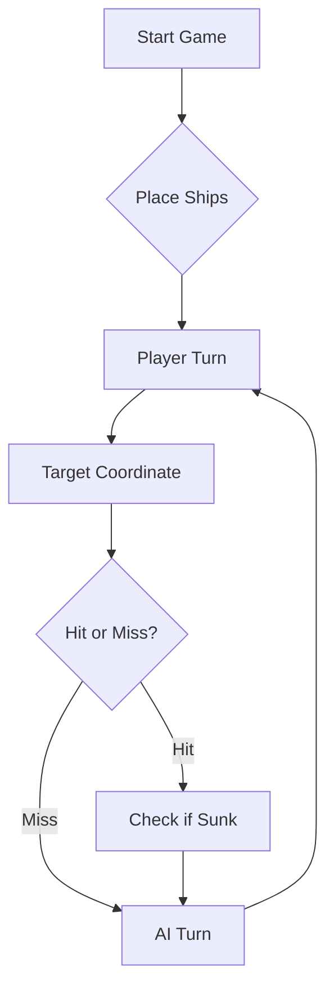

# ⚓ Battleship 2.0


> A modern take on the classic naval warfare game, designed for the XVII century setting with updated software engineering patterns.

---

## Link do video

https://youtu.be/c8THn1gbzZw

## 📖 Table of Contents
- [Project Overview](#-project-overview)
- [Key Features](#-key-features)
- [Technical Stack](#-technical-stack)
- [Installation & Setup](#-installation--setup)
- [Code Architecture](#-code-architecture)
- [Roadmap](#-roadmap)
- [Contributing](#-contributing)

---

## 🎯 Project Overview
This project serves as a template and reference for students learning **Object-Oriented Programming (OOP)** and **Software Quality**. It simulates a battleship environment where players must strategically place ships and sink the enemy fleet.

### 🎮 The Rules
The game is played on a grid (typically 10x10). The coordinate system is defined as:

$$(x, y) \in \{0, \dots, 9\} \times \{0, \dots, 9\}$$

Hits are calculated based on the intersection of the shot vector and the ship's bounding box.

---

## ✨ Key Features
| Feature | Description | Status |
| :--- | :--- | :---: |
| **Grid System** | Flexible $N \times N$ board generation. | ✅ |
| **Ship Varieties** | Galleons, Frigates, and Brigantines (XVII Century theme). | ✅ |
| **AI Opponent** | Heuristic-based targeting system. | 🚧 |
| **Network Play** | Socket-based multiplayer. | ❌ |

---

## 🛠 Technical Stack
* **Language:** Java 17
* **Build Tool:** Maven / Gradle
* **Testing:** JUnit 5
* **Logging:** Log4j2

---

## 🚀 Installation & Setup

### Prerequisites
* JDK 17 or higher
* Git

### Step-by-Step
1. **Clone the repository:**
   ```bash
   git clone [https://github.com/britoeabreu/Battleship2.git](https://github.com/britoeabreu/Battleship2.git)
   ```
2. **Navigate to directory:**
   ```bash
   cd Battleship2
   ```
3. **Compile and Run:**
   ```bash
   javac Main.java && java Main
   ```

---

## 📚 Documentation

You can access the generated Javadoc here:

👉 [Battleship2 API Documentation](https://britoeabreu.github.io/Battleship2/)


### Core Logic
```java
public class Ship {
    private String name;
    private int size;
    private boolean isSunk;

    // TODO: Implement damage logic
    public void hit() {
        // Implementation here
    }
}
```

### Design Patterns Used:
- **Strategy Pattern:** For different AI difficulty levels.
- **Observer Pattern:** To update the UI when a ship is hit.
</details>

### Logic Flow


---

## 🗺 Roadmap
- [x] Basic grid implementation
- [x] Ship placement validation
- [ ] Add sound effects (SFX)
- [ ] Implement "Fog of War" mechanic
- [ ] **Multiplayer Integration** (High Priority)

---

## 🧪 Testing
We use high-coverage unit testing to ensure game stability. Run tests using:
```bash
mvn test
```

> [!TIP]
> Use the `-Dtest=ClassName` flag to run specific test suites during development.

---

## 🤝 Contributing
Contributions are what make the open-source community such an amazing place to learn, inspire, and create.

1. Fork the Project
2. Create your Feature Branch (`git checkout -b feature/AmazingFeature`)
3. Commit your Changes (`git commit -m 'Add some AmazingFeature'`)
4. Push to the Branch (`git push origin feature/AmazingFeature`)
5. Open a **Pull Request**

---

## Prompt final
Quando atingires um navio sem o afundar, segue esta ordem de prioridade:
  - Se só tens 1 acerto nesse navio: dispara nas 4 direções ortogonais(Norte, Sul, Este, Oeste) em jogadas seguintes, uma de cada vez.
  - Se tens 2 acertos no mesmo navio: já sabes a orientação (horizontal ou vertical). Continua APENAS nessa direção, para ambos os lados,até afundar. Não percas       tiros nas outras direções.
  - Se tens múltiplos navios atingidos em simultâneo: termina de afundar o maior antes de passar ao seguinte — navios maiores têm mais posições e confirmam mais       "água garantida" em redor.

Quando não há alvos prioritários (nenhum navio atingido pendente), usa um padrão de varredura em xadrez: dispara apenas em posições onde a soma (linha + coluna) é par por exemplo A1, A3, C2, B5.

Porquê? A menor embarcação (Barca) ocupa 1 posição, mas a Caravela ocupa 2. Com o padrão de xadrez garantes que nenhuma Caravela, Nau, Fragata ou Galeão pode existir no tabuleiro sem que pelo menos 1 das suas posições seja coberta pelo padrão. Isto reduz os tiros necessários para encontrar todos os navios em aproximadamente 50%.

O Galeão tem forma de T com 4 orientações possíveis. Quando atingires uma posição que pode ser parte do Galeão:
  - Se os acertos formam uma linha reta de 3: pode ser o corpo do T. Dispara também nas posições perpendiculares ao centro da linha, pois podem ser as "asas".
  - Se encontrares acertos em L ou T: confirmaste o Galeão. Completa o padrão em T na orientação correspondente.

Nunca descartares uma posição diagonal como "água garantida" enquanto não confirmares que o navio atingido não é o Galeão.

Rajada 5 resultado: {"validShots":3, "hitsOnBoats":[{"hits":1,"type":"Nau"}], "missedShots":2}

Raciocínio:
  - Atingi a Nau em C5 (único acerto desta rajada).
  - A Nau ocupa 3 posições em linha reta (N-S ou E-O).
  - Próxima jogada: disparo em C4 e C6 (vertical) e B5 e D5 (horizontal)
    para descobrir a orientação. Escolho C4, C6 e B5 para esta rajada.
  - As diagonais B4, B6, D4, D6 são água garantida — marco como proibidas.

Próxima rajada: [C4, C6, B5]

Controlo de fim de jogo:
  - Após cada rajada, verifica se o total de posições afundadas soma 20(4×1 + 3×2 + 2×3 + 1×4 + 1×5 = 20). Se sim, declara vitória.
  - Se receberes uma mensagem de que a tua frota foi toda afundada, declara derrota com a mensagem: "A minha frota foi ao fundo. Glub glub."
  - Na última rajada (quando faltam poucos navios), é aceitável repetir uma posição já disparada apenas para perfazer os 3 tiros obrigatórios.

---

## 📄 License
Distributed under the MIT License. See `LICENSE` for more information.

---
**Maintained by:** [@britoeabreu](https://github.com/britoeabreu)  
*Created for the Software Engineering students at ISCTE-IUL.*
